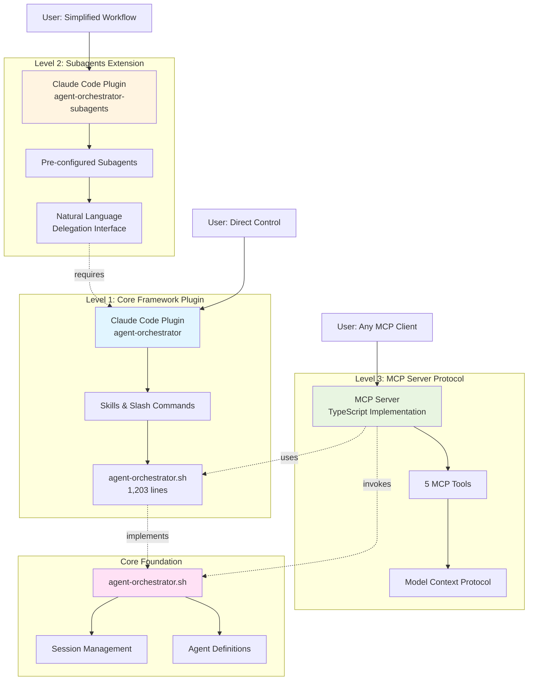

# Three Usage Levels of Agent Orchestrator Framework

## Diagram

## Architectural Aspects Covered

This diagram illustrates the **three-tier usage model** of the Agent Orchestrator Framework (AOF), showing:

### 1. **Progressive Enhancement Architecture**
- **Level 1**: Direct, low-level control through Claude Code plugin with skills and slash commands
- **Level 2**: Higher-level abstraction with pre-configured subagents for delegation-based workflows
- **Level 3**: Protocol-level abstraction enabling any MCP-compatible system to orchestrate agents

### 2. **Dependency Relationships**
- Level 2 **requires** Level 1 (both must be installed as Claude Code plugins)
- Level 3 is **independent** and directly invokes the core script
- All levels share the same foundational `agent-orchestrator.sh` script

### 3. **User Interaction Models**
- **Level 1**: Command-line style with slash commands (`/agent-orchestrator-init`)
- **Level 2**: Natural language delegation ("Use the orchestrated-agent-launcher subagent...")
- **Level 3**: MCP tools accessible from any compatible client (Claude Desktop, Claude Code, etc.)

### 4. **Integration Scope**
- **Levels 1 & 2**: Claude Code only
- **Level 3**: Any MCP-compatible AI system (Claude Desktop, other tools)

### 5. **Core Foundation**
The `agent-orchestrator.sh` bash script (1,203 lines) is the single source of truth for:
- Session lifecycle management
- Agent definition handling
- MCP configuration injection
- Result extraction and formatting

This architecture enables users to choose the integration approach that best fits their needs while maintaining a unified core implementation.
