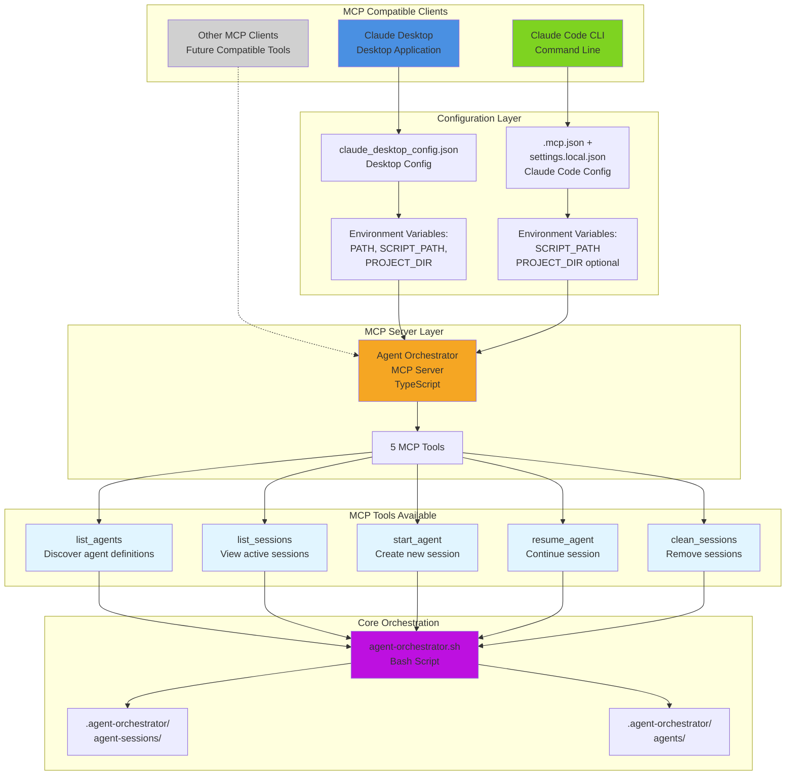

# Level 3: MCP Client Integration

## Diagram

## Architectural Aspects Covered

This diagram illustrates the **MCP client integration model** for Level 3 usage, showing:

### 1. **Multiple Client Support**
The MCP server provides a universal interface accessible from:
- **Claude Desktop**: Desktop application with GUI
- **Claude Code CLI**: Command-line interface
- **Future MCP Clients**: Any tool implementing the Model Context Protocol

### 2. **Client-Specific Configuration**

#### Claude Desktop
- Configuration file: `~/Library/Application Support/Claude/claude_desktop_config.json` (macOS)
- **Required**: `PATH` environment variable (UI apps don't inherit shell PATH)
- **Required**: `AGENT_ORCHESTRATOR_SCRIPT_PATH`
- **Required**: `AGENT_ORCHESTRATOR_PROJECT_DIR`

#### Claude Code
- Configuration files: `.mcp.json` (committable) + `.claude/settings.local.json` (local)
- **Required**: `AGENT_ORCHESTRATOR_SCRIPT_PATH`
- **Optional**: `AGENT_ORCHESTRATOR_PROJECT_DIR` (defaults to current directory)

### 3. **Unified MCP Tools Interface**
Regardless of client, all get access to the same 5 tools:
1. **list_agents**: Discover available specialized agent definitions
2. **list_sessions**: View all agent sessions and their IDs
3. **start_agent**: Create new agent sessions (generic or specialized)
4. **resume_agent**: Continue work in existing sessions
5. **clean_sessions**: Remove all sessions

### 4. **Protocol Abstraction Benefits**
- **No plugin installation required**: Level 3 doesn't need Claude Code plugins
- **Standardized interface**: MCP provides consistent tool access across clients
- **Client independence**: Same backend works with any MCP-compatible client
- **Type safety**: TypeScript implementation with Zod validation

### 5. **Shared Core Foundation**
All clients, regardless of type, ultimately invoke the same:
- `agent-orchestrator.sh` bash script for orchestration logic
- `.agent-orchestrator/agent-sessions/` for session persistence
- `.agent-orchestrator/agents/` for agent definitions

This architecture enables the Agent Orchestrator Framework to work with any MCP-compatible AI system while maintaining a single, consistent implementation.
