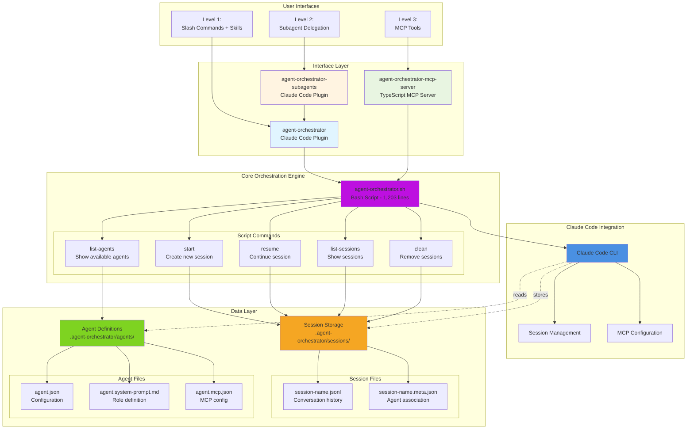

# Core Components and Architecture

## Diagram

## Architectural Aspects Covered

This diagram illustrates the **core component architecture** of the Agent Orchestrator Framework, showing:

### 1. **Layered Architecture**
The framework follows a clear separation of concerns:
- **User Interface Layer**: Three distinct entry points (slash commands, subagents, MCP tools)
- **Interface Layer**: Platform-specific implementations (plugins, MCP server)
- **Core Engine**: Single unified orchestration script
- **Integration Layer**: Claude Code CLI integration
- **Data Layer**: Persistent storage for sessions and agents

### 2. **Core Orchestration Engine**
The `agent-orchestrator.sh` script is the heart of the framework:
- **1,203 lines of bash**: Single source of truth for orchestration logic
- **Five main commands**: start, resume, list-agents, list-sessions, clean
- **Stateless design**: All state stored in data layer
- **CLI integration**: Manages Claude Code CLI invocations

### 3. **Command Responsibilities**
- **start**: Creates new agent sessions (generic or specialized)
- **resume**: Continues existing sessions with new prompts
- **list-agents**: Discovers available agent definitions
- **list-sessions**: Shows active and completed sessions
- **clean**: Removes all session data

### 4. **Data Persistence Model**

#### Session Storage
- **JSONL files**: Complete conversation history (Claude Code format)
- **Meta files**: Agent associations, timestamps, configuration

#### Agent Definitions
- **agent.json**: Required metadata (name, description)
- **agent.system-prompt.md**: Optional role definition
- **agent.mcp.json**: Optional MCP server configuration

### 5. **Integration Points**
- **Claude Code CLI**: Underlying execution engine for agents
- **MCP Configuration**: Per-agent tool access control
- **Session Management**: Conversation state and history
- **Result Extraction**: Automated parsing of agent outputs

### 6. **Unified Backend**
All three usage levels (direct plugin, subagents, MCP) converge on:
- Same orchestration script
- Same session storage format
- Same agent definition structure
- Same Claude Code CLI integration

This architecture ensures consistency across all usage modes while providing flexibility in how users interact with the framework.
