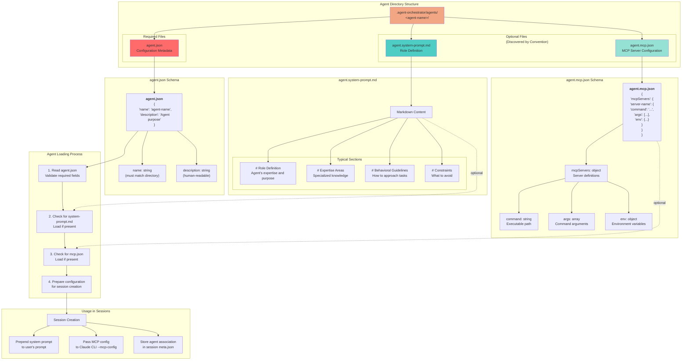

# Agent Definition Structure

## Diagram



## Architectural Aspects Covered

This diagram illustrates the **agent definition structure and composition** in the Agent Orchestrator Framework, showing:

### 1. **File Organization**
Agents are organized in a directory-per-agent structure:
```
.agent-orchestrator/agents/
├── system-architect/
│   ├── agent.json                 # Required
│   ├── agent.system-prompt.md     # Optional
│   └── agent.mcp.json             # Optional
├── code-reviewer/
│   ├── agent.json
│   ├── agent.system-prompt.md
│   └── agent.mcp.json
└── documentation-writer/
    └── agent.json
```

### 2. **Required Configuration (agent.json)**
Every agent must have an `agent.json` file containing:
- **name**: Agent identifier (must match the directory name)
- **description**: Human-readable description of the agent's purpose

Example:
```json
{
  "name": "browser-tester",
  "description": "Specialist in browser automation and end-to-end testing using Playwright"
}
```

### 3. **Optional System Prompt (agent.system-prompt.md)**
Discovered by convention (no need to reference in agent.json):
- **Markdown format**: Natural language role definition
- **Prepended to prompts**: Automatically added before user's prompt
- **Typical sections**:
  - Role definition and expertise
  - Specialized knowledge areas
  - Behavioral guidelines
  - Constraints and limitations

Example:
```markdown
# Role Definition
You are a system architecture expert specializing in designing scalable, maintainable software systems.

# Expertise Areas
- Microservices architecture
- Distributed systems design
- Cloud-native applications
- API design and integration patterns
```

### 4. **Optional MCP Configuration (agent.mcp.json)**
Discovered by convention (no need to reference in agent.json):
- **Standard MCP format**: Same as Claude Desktop/Code MCP configuration
- **Passed to Claude CLI**: Via `--mcp-config` flag
- **Enables tool access**: Specialized capabilities per agent type

Example:
```json
{
  "mcpServers": {
    "playwright": {
      "command": "npx",
      "args": ["-y", "@modelcontextprotocol/server-playwright"],
      "env": {}
    }
  }
}
```

### 5. **Convention-Based Discovery**
The framework uses **convention over configuration**:
- **No explicit file references**: Files discovered by standardized naming
- **Optional components**: System prompt and MCP config are opt-in
- **Fail gracefully**: Missing optional files don't cause errors
- **Consistent naming**: Predictable structure across all agents

### 6. **Agent Loading Process**
When a session uses an agent:
1. **Load agent.json**: Validate required metadata
2. **Check for system-prompt.md**: Load if present
3. **Check for mcp.json**: Load if present
4. **Prepare configuration**: Combine all components
5. **Create session**: Apply configuration to new session

### 7. **Integration with Sessions**
Agent configuration affects session behavior:
- **System Prompt**: Prepended to every prompt (first use and resumes)
- **MCP Configuration**: Enables specialized tools and capabilities
- **Agent Association**: Stored in session metadata for resume operations
- **Conversation Context**: Agent identity maintained across session lifecycle

### 8. **Separation of Concerns**
- **Agent**: Reusable blueprint defining behavior and capabilities
- **Session**: Specific conversation instance using an agent
- One agent can spawn multiple sessions
- Sessions remember their agent association

### 9. **Flexibility**
The structure supports various use cases:
- **Minimal agents**: Just `agent.json` for generic specialized sessions
- **Prompted agents**: Add `system-prompt.md` for role-based behavior
- **Tool-enabled agents**: Add `mcp.json` for specialized capabilities
- **Full-featured agents**: All three files for comprehensive specialization

This design enables creating a library of reusable, specialized agents while keeping the configuration simple and maintainable.
