# Directory Structure and File Organization

## Diagram

```mermaid
graph TB
    subgraph "Project Root"
        Root[Project Directory<br/>PWD where orchestrator runs]
    end

    subgraph ".agent-orchestrator/"
        AOF[Framework Directory<br/>.agent-orchestrator/]

        subgraph "agents/<br/>Agent Definitions"
            AgentsDir[agents/]

            subgraph "system-architect/"
                SA_Dir[system-architect/]
                SA_JSON[agent.json<br/>Required metadata]
                SA_Prompt[agent.system-prompt.md<br/>Role definition]
                SA_MCP[agent.mcp.json<br/>MCP servers]

                SA_Dir --> SA_JSON
                SA_Dir --> SA_Prompt
                SA_Dir --> SA_MCP
            end

            subgraph "code-reviewer/"
                CR_Dir[code-reviewer/]
                CR_JSON[agent.json]
                CR_Prompt[agent.system-prompt.md]
                CR_MCP[agent.mcp.json]

                CR_Dir --> CR_JSON
                CR_Dir --> CR_Prompt
                CR_Dir --> CR_MCP
            end

            subgraph "browser-tester/"
                BT_Dir[browser-tester/]
                BT_JSON[agent.json]
                BT_Prompt[agent.system-prompt.md]
                BT_MCP[agent.mcp.json]

                BT_Dir --> BT_JSON
                BT_Dir --> BT_Prompt
                BT_Dir --> BT_MCP
            end

            AgentsDir --> SA_Dir
            AgentsDir --> CR_Dir
            AgentsDir --> BT_Dir
        end

        subgraph "sessions/<br/>Active & Completed Sessions"
            SessionsDir[sessions/]

            subgraph "Session: architect-review"
                S1_Dir[architect-review/]
                S1_JSONL[architect-review.jsonl<br/>Conversation history]
                S1_Meta[architect-review.meta.json<br/>Session metadata]
                S1_ID[session-id.txt<br/>Claude session UUID]

                S1_Dir --> S1_JSONL
                S1_Dir --> S1_Meta
                S1_Dir --> S1_ID
            end

            subgraph "Session: code-review-main"
                S2_Dir[code-review-main/]
                S2_JSONL[code-review-main.jsonl]
                S2_Meta[code-review-main.meta.json]
                S2_ID[session-id.txt]

                S2_Dir --> S2_JSONL
                S2_Dir --> S2_Meta
                S2_Dir --> S2_ID
            end

            subgraph "Session: browser-test-auth"
                S3_Dir[browser-test-auth/]
                S3_JSONL[browser-test-auth.jsonl]
                S3_Meta[browser-test-auth.meta.json]
                S3_ID[session-id.txt]

                S3_Dir --> S3_JSONL
                S3_Dir --> S3_Meta
                S3_Dir --> S3_ID
            end

            SessionsDir --> S1_Dir
            SessionsDir --> S2_Dir
            SessionsDir --> S3_Dir
        end

        AOF --> AgentsDir
        AOF --> SessionsDir
    end

    Root --> AOF

    subgraph "File Details"
        subgraph "agent.json"
            AJ_Content["
                {
                    'name': 'agent-name',
                    'description': 'Purpose'
                }
            "]
        end

        subgraph "session.jsonl"
            JSONL_Content["
                Line 1: System message
                Line 2: User prompt
                Line 3: Assistant response
                ... (conversation history)
            "]
        end

        subgraph "session.meta.json"
            Meta_Content["
                {
                    'sessionName': 'name',
                    'agentName': 'agent',
                    'created': 'timestamp',
                    'lastAccessed': 'timestamp',
                    'status': 'completed'
                }
            "]
        end

        subgraph "session-id.txt"
            ID_Content["UUID string<br/>3db5dca9-6829-4cb7-a645-c64dbd98244d"]
        end
    end

    SA_JSON -.format.-> AJ_Content
    S1_JSONL -.format.-> JSONL_Content
    S1_Meta -.format.-> Meta_Content
    S1_ID -.format.-> ID_Content

    style Root fill:#F3F4F6
    style AOF fill:#FEF3C7
    style AgentsDir fill:#DBEAFE
    style SessionsDir fill:#DCFCE7
    style SA_Dir fill:#E0E7FF
    style CR_Dir fill:#E0E7FF
    style BT_Dir fill:#E0E7FF
    style S1_Dir fill:#D1FAE5
    style S2_Dir fill:#D1FAE5
    style S3_Dir fill:#D1FAE5
```



## Architectural Aspects Covered

This diagram illustrates the **complete directory structure and file organization** of the Agent Orchestrator Framework, showing:

### 1. **Project-Relative Structure**
All AOF infrastructure lives in `.agent-orchestrator/` within the project directory:
```
/path/to/project/
└── .agent-orchestrator/
    ├── agents/         # Agent definitions
    └── sessions/       # Session data
```

### 2. **Agent Storage (agents/)**
Each agent is a self-contained directory with standardized files:

```
agents/
├── system-architect/
│   ├── agent.json                 # Required: Metadata
│   ├── agent.system-prompt.md     # Optional: Role definition
│   └── agent.mcp.json             # Optional: MCP config
├── code-reviewer/
│   ├── agent.json
│   ├── agent.system-prompt.md
│   └── agent.mcp.json
└── browser-tester/
    ├── agent.json
    ├── agent.system-prompt.md
    └── agent.mcp.json
```

**Directory naming**: Must match the agent name in `agent.json`

### 3. **Session Storage (sessions/)**
Each session has its own directory containing three files:

```
sessions/
└── architect-review/
    ├── architect-review.jsonl        # Conversation history
    ├── architect-review.meta.json    # Session metadata
    └── session-id.txt                # Claude session UUID
```

**Directory naming**: Matches the session name provided by user

### 4. **File Types and Purposes**

#### agent.json (Required)
```json
{
  "name": "system-architect",
  "description": "Expert in designing scalable system architectures"
}
```
- Agent metadata
- Name must match directory
- Description for discovery

#### agent.system-prompt.md (Optional)
```markdown
# Role Definition
You are a system architecture expert...

# Expertise Areas
- Microservices architecture
- Cloud-native applications
```
- Markdown-formatted role definition
- Prepended to user prompts
- Discovered by convention

#### agent.mcp.json (Optional)
```json
{
  "mcpServers": {
    "playwright": {
      "command": "npx",
      "args": ["-y", "@modelcontextprotocol/server-playwright"]
    }
  }
}
```
- Standard MCP configuration
- Passed to Claude CLI
- Enables specialized tools

#### session.jsonl (Auto-generated)
```
{"type":"system","text":"System prompt..."}
{"type":"user","text":"User: Design a system"}
{"type":"assistant","text":"Assistant: Here's the design..."}
```
- JSONL format (one JSON object per line)
- Complete conversation history
- Claude Code session format

#### session.meta.json (Auto-generated)
```json
{
  "sessionName": "architect-review",
  "agentName": "system-architect",
  "created": "2025-01-15T10:30:00Z",
  "lastAccessed": "2025-01-15T11:45:00Z",
  "status": "completed"
}
```
- Session metadata and tracking
- Agent association for resume
- Timestamps and status

#### session-id.txt (Auto-generated)
```
3db5dca9-6829-4cb7-a645-c64dbd98244d
```
- Claude Code session UUID
- Used for internal session management
- Hidden from user (they use session name)

### 5. **File Lifecycle**

#### Agent Files (Manual Creation)
- Created by users or framework
- Stored persistently
- Reusable across sessions
- Version-controllable

#### Session Files (Auto-generated)
- Created during `start` command
- Updated during `resume` command
- Deleted during `clean` command
- Not typically version-controlled

### 6. **Directory Isolation**
Each session and agent is completely isolated:
- **No cross-contamination**: Sessions don't interfere with each other
- **Parallel execution**: Multiple sessions can run simultaneously
- **Independent lifecycle**: Sessions can be created/deleted independently

### 7. **Configuration Flexibility**
The default structure can be customized via environment variables:
- `AGENT_ORCHESTRATOR_PROJECT_DIR`: Base project directory
- `AGENT_ORCHESTRATOR_SESSIONS_DIR`: Custom session storage location
- `AGENT_ORCHESTRATOR_AGENTS_DIR`: Custom agent definitions location

Example custom configuration:
```bash
# Store sessions centrally across all projects
AGENT_ORCHESTRATOR_SESSIONS_DIR=/Users/me/.aof-sessions

# Share agent definitions globally
AGENT_ORCHESTRATOR_AGENTS_DIR=/Users/me/.aof-agents

# Work on specific project
AGENT_ORCHESTRATOR_PROJECT_DIR=/path/to/project
```

### 8. **Storage Strategy Benefits**
- **File-based**: No database required, simple and portable
- **Human-readable**: JSON/JSONL formats for easy inspection
- **Git-friendly**: Agents can be version-controlled (sessions typically ignored)
- **Backup-friendly**: Simple file copy for backup/restore
- **Transparent**: Users can inspect all state directly

This directory structure provides a clean, organized, and flexible foundation for managing multiple agents and sessions within any project.
