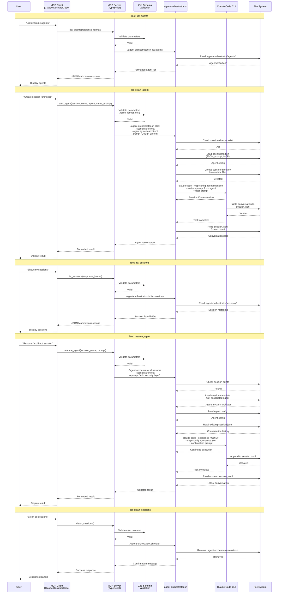

# MCP Server Integration and Tool Flow

## Diagram



## Architectural Aspects Covered

This diagram illustrates the **complete request flow through the MCP server integration**, showing:

### 1. **Multi-Layer Architecture**
The request flows through five distinct layers:
1. **User Layer**: Human interaction with natural language
2. **MCP Client Layer**: Claude Desktop/Code translating to MCP protocol
3. **MCP Server Layer**: TypeScript server handling protocol and orchestration
4. **Script Layer**: Bash orchestration logic
5. **Storage Layer**: File system persistence

### 2. **MCP Server Responsibilities**

#### Type Safety and Validation
- **Zod schemas**: Validate all incoming parameters
- **Input sanitization**: Session names, formats, required fields
- **Error handling**: Return clear, actionable error messages
- **Response formatting**: JSON or Markdown based on preference

#### Tool Implementation
All 5 tools follow the same pattern:
1. Receive MCP tool call from client
2. Validate parameters with Zod
3. Invoke `agent-orchestrator.sh` with appropriate command
4. Process script output
5. Format and return response

### 3. **Tool-Specific Flows**

#### list_agents Flow
```
User → MCP Client → MCP Server → Script → File System
↓
Read agents/ directory
↓
Return agent metadata (name, description)
↓
Format as JSON or Markdown
↓
Return to user
```

#### start_agent Flow
```
User → MCP Client → MCP Server → Script
↓
Validate session name (unique, format)
↓
Load agent definition (if specified)
↓
Create session directory structure
↓
Invoke Claude CLI with agent config
↓
Wait for completion
↓
Extract result from JSONL
↓
Return to user
```

#### list_sessions Flow
```
User → MCP Client → MCP Server → Script → File System
↓
Read sessions/ directory
↓
Read each session metadata
↓
Return list with session IDs and status
↓
Format as JSON or Markdown
↓
Return to user
```

#### resume_agent Flow
```
User → MCP Client → MCP Server → Script
↓
Validate session exists
↓
Load session metadata & associated agent
↓
Load agent configuration
↓
Read existing conversation history
↓
Invoke Claude CLI with session ID
↓
Append new prompt to conversation
↓
Wait for completion
↓
Extract updated result
↓
Return to user
```

#### clean_sessions Flow
```
User → MCP Client → MCP Server → Script → File System
↓
Remove entire sessions/ directory
↓
Return confirmation
↓
User notified
```

### 4. **Validation Layer (Zod Schemas)**
All tool parameters are validated before execution:

```typescript
// Example: start_agent validation
{
  session_name: z.string()
    .min(1).max(60)
    .regex(/^[a-zA-Z0-9_-]+$/),
  agent_name: z.string().optional(),
  prompt: z.string().min(1),
  response_format: z.enum(["markdown", "json"]).optional()
}
```

**Benefits**:
- Type safety at runtime
- Clear error messages for invalid input
- Prevents malformed requests from reaching script
- Consistent validation across all tools

### 5. **Script Invocation Patterns**

The MCP server invokes the bash script with different commands:

```bash
# List agents
./agent-orchestrator.sh list-agents

# Start new session
./agent-orchestrator.sh start \
  --session <name> \
  --agent <agent-name> \
  --prompt "<prompt>"

# Resume session
./agent-orchestrator.sh resume \
  --session <name> \
  --prompt "<prompt>"

# List sessions
./agent-orchestrator.sh list-sessions

# Clean sessions
./agent-orchestrator.sh clean
```

### 6. **Claude CLI Integration**
The script manages Claude Code CLI invocations:

**New Sessions**:
```bash
claude code \
  --mcp-config path/to/agent.mcp.json \
  --system-prompt "$(cat agent.system-prompt.md)" \
  "User prompt here"
```

**Resume Sessions**:
```bash
claude code \
  --session-id <uuid> \
  --mcp-config path/to/agent.mcp.json \
  "Continuation prompt"
```

### 7. **File System Interactions**

#### Read Operations
- Agent definitions from `agents/` directory
- Session metadata from `sessions/` directory
- Conversation history from `.jsonl` files
- Session UUIDs from `session-id.txt`

#### Write Operations
- Create session directories
- Generate session metadata files
- Store session UUIDs
- Claude CLI writes to `.jsonl` (managed by CLI)

### 8. **Response Format Flexibility**
All tools support dual output formats:

**Markdown** (default):
```markdown
# Available Agents

- **system-architect**: Expert in designing scalable architectures
- **code-reviewer**: Reviews code for best practices
```

**JSON**:
```json
{
  "total": 2,
  "agents": [
    {"name": "system-architect", "description": "..."},
    {"name": "code-reviewer", "description": "..."}
  ]
}
```

### 9. **Error Handling at Each Layer**

- **MCP Client**: User-friendly error display
- **MCP Server**: Validation errors, formatted responses
- **Script Layer**: Exit codes, stderr messages
- **File System**: Permission errors, not found errors
- **Claude CLI**: Execution failures, timeout errors

Each layer reports errors in a format the next layer can handle.

### 10. **State Management**
- **Stateless Server**: MCP server maintains no state between requests
- **File-Based State**: All state persisted to file system
- **Session Isolation**: Each session completely independent
- **Concurrent Safety**: Multiple sessions can run in parallel

This architecture provides a robust, type-safe, and flexible integration layer that makes agent orchestration accessible through the standard MCP protocol.
