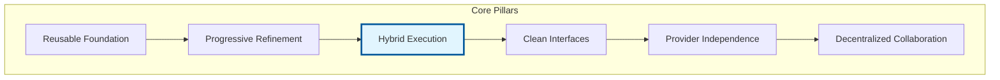
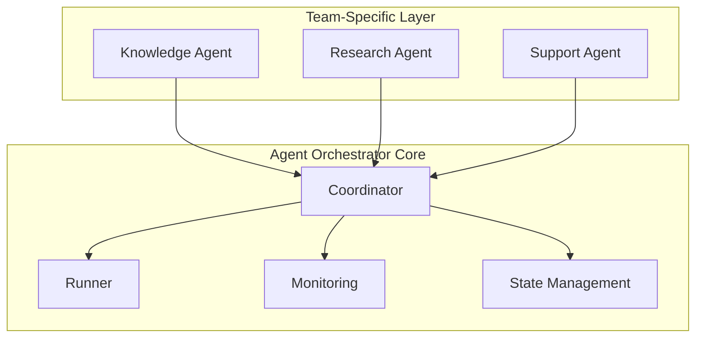
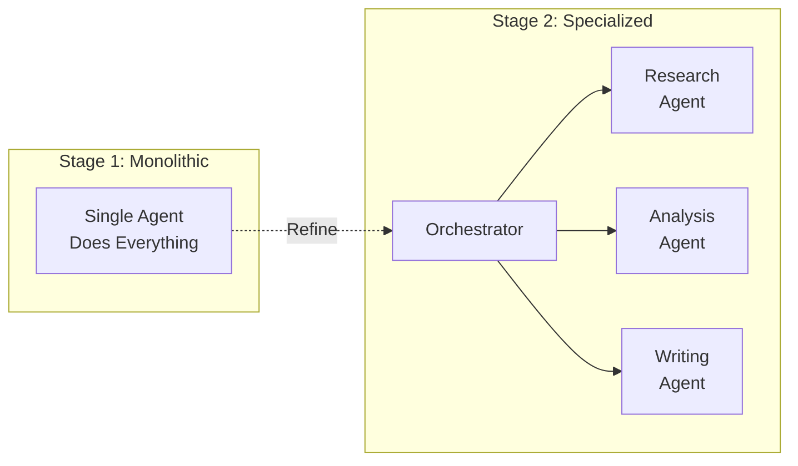
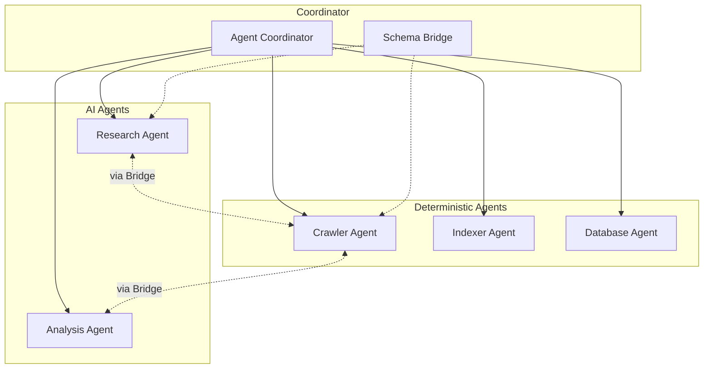
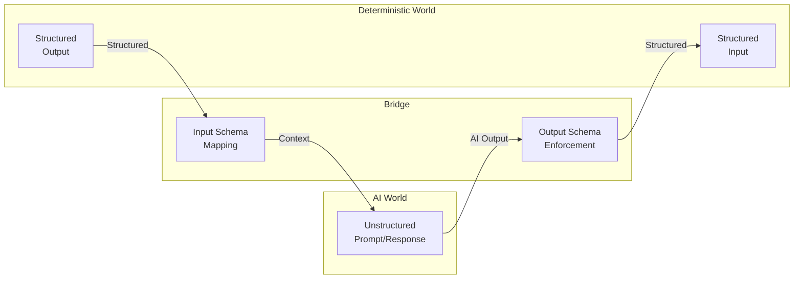
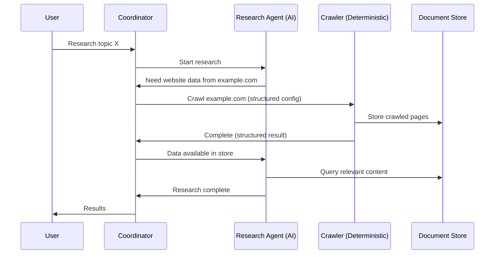
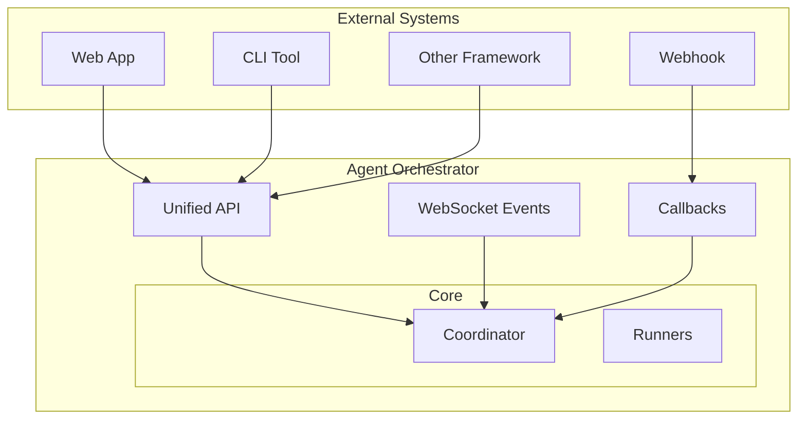
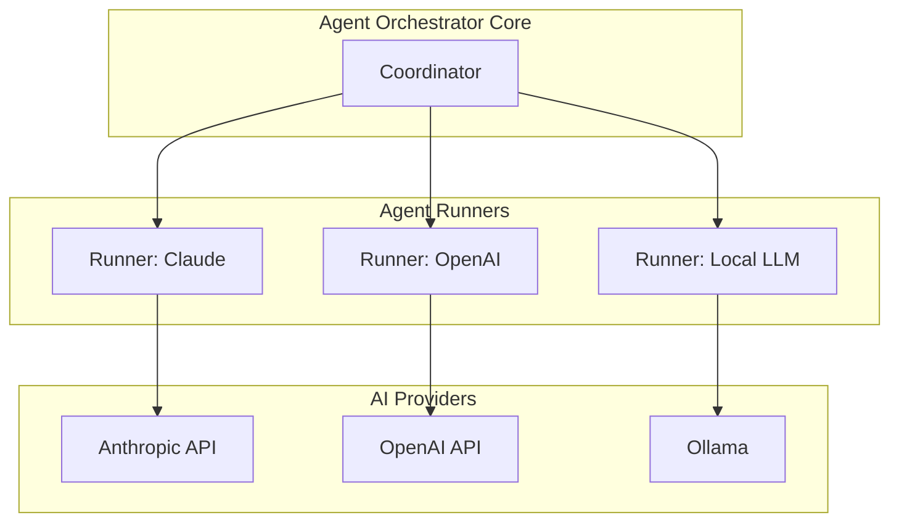
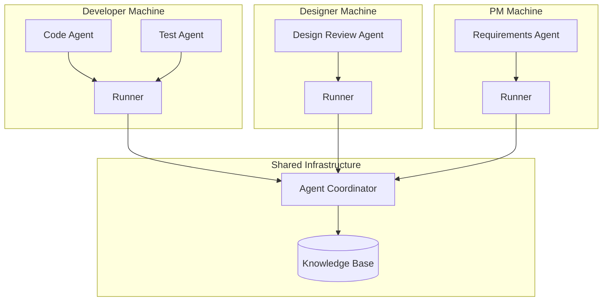
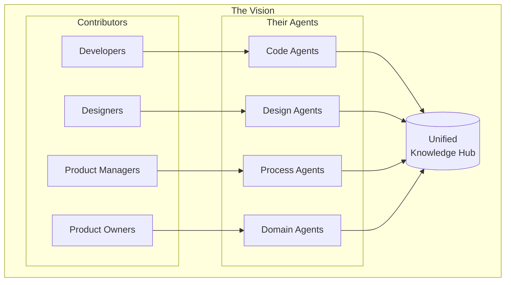

# Agent Orchestrator - Vision & Concepts

This document explains the core pillars of the Agent Orchestrator framework, providing detailed descriptions and visualizations to convey the vision.

## Overview

The highlighted pillar (Hybrid Execution) is the current focus.

---

## 1. Reusable Foundation

**The Problem:** Every time a team wants to build an agentic tool, they start from scratch - building orchestration, execution management, monitoring, and integration layers all over again.

**The Solution:** Agent Orchestrator provides a reusable core that handles the infrastructure, so teams can focus on their specific use case.

**What this enables:**
- Build POCs quickly without infrastructure overhead
- Transition POCs to production on the same foundation
- Share learnings and patterns across projects

**Status:** Implemented

---

## 2. Progressive Refinement

**The Problem:** When starting with AI agents, the tendency is to build one large agent that "does everything." This works initially but becomes hard to maintain, debug, and improve.

**The Solution:** Start simple, then progressively break down agents into specialized, orchestrated components. This is a process for refining ideas - not just running them.

**The refinement journey:**
1. Start with a simple, high-level agent ("AI can do everything")
2. Observe where it struggles or is inefficient
3. Extract that capability into a specialized agent
4. Orchestrate the specialists together
5. Repeat - each iteration adds focus and reliability

**Status:** Implemented

---

## 3. Hybrid Execution

**The Problem:** AI agents are powerful but non-deterministic and can be slow for certain tasks. Traditional programs are fast and reliable but can't reason. Currently, there's no clean way to combine both in the same orchestration.

**The Solution:** Treat AI agents and deterministic agents as peers. Both can be orchestrated, both can call each other, and a translation bridge handles the schema gap between unstructured and structured data.

### Architecture

### The Schema Bridge

The core challenge is translating between two worlds:

**Key insight:** The framework owns the schema, not the agent. The coordinator knows:
- Which agent is calling
- What output schema is expected
- How to transform between formats

### Example: Research with Crawler

**Why deterministic agents?**
- **Faster:** No LLM inference overhead
- **Reliable:** Same input = same output
- **Efficient:** Optimized for specific tasks
- **Predictable:** Easier to debug and monitor

**Status:** Next Priority (Vision)

---

## 4. Clean Interfaces

**The Problem:** Integrating external systems with agent frameworks often requires deep knowledge of the framework internals. Each integration is custom.

**The Solution:** Provide uniform, well-defined connection points that external systems can plug into easily.

**Interface principles:**
- Simple to understand, simple to use
- Consistent patterns across all connection types
- Easy to adapt without framework changes

**Status:** Implemented

---

## 5. Provider Independence

**The Problem:** AI frameworks often lock you into a specific provider (OpenAI, Anthropic, etc.). Switching providers means rewriting significant code.

**The Solution:** Agent Runners abstract the AI provider. The core framework doesn't know or care which provider executes the agent.

**The balance:** Abstraction has costs. Too much abstraction adds complexity and hides provider-specific capabilities. The current approach:
- Abstract at the runner level
- Keep provider-specific optimizations in executors
- Don't over-abstract - know when to stop

**Status:** Implemented

---

## 6. Decentralized Collaboration

**The Problem:** Agent systems are typically centralized. One team controls the agents, one server runs them. This doesn't match how real teams work - distributed, with different expertise and access.

**The Solution:** Allow agent runners on different machines to contribute to a shared orchestration. Each team member can provide specialized agents.

**The vision:**
- A project team shares an orchestrator and knowledge base
- Developer contributes code-related agents
- Designer contributes design review agents
- PM contributes requirements and process agents
- All agents can collaborate and share context
- Domain experts describe agents; programmers build capabilities

**Status:** Early Vision

---

## Current Focus

The immediate priority is **Hybrid Execution** - creating the bridge between AI agents and deterministic agents.

**Why this first:**
1. Enables structured data flow through the system
2. Makes external service integration cleaner and more reliable
3. Lays groundwork for knowledge management (structured = queryable)
4. Combines the strengths of AI reasoning with deterministic efficiency

---

## Long-term Vision

A unified knowledge hub where all project disciplines - designers, developers, PMs, product owners - contribute and collaborate through specialized agents.

**Characteristics:**
- Programmers build capabilities (MCP servers, skills)
- Domain experts describe agents and add requirements
- Knowledge base covers all dimensions of a project
- Accessible to everyone, not just programmers
- Agents collaborate, humans collaborate through agents

This is the north star - a long-term goal that guides decisions today.
