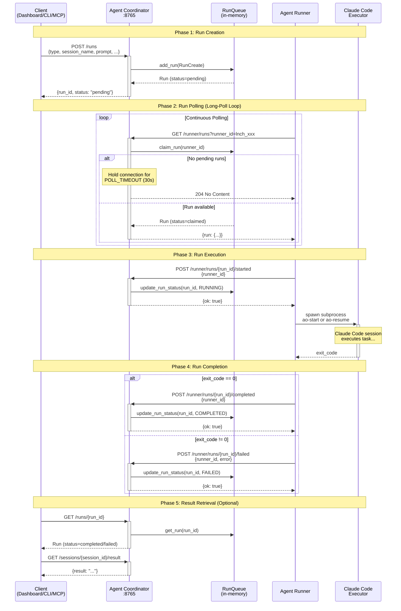

# Run Execution Flow

This document explains the complete lifecycle of a run from creation to completion, with a focus on the Agent Runner's polling mechanism.

## Overview

When a client (Dashboard, CLI, or MCP Server) wants to start or resume an agent session, it doesn't spawn the process directly. Instead, it creates a **run** in the Agent Coordinator's queue. The **Agent Runner**, running on a host machine, continuously polls for pending runs, claims them, and executes them.

This decoupled architecture allows:
- Agent Coordinator to run in containers (no subprocess spawning needed)
- Multiple runners to distribute workload across machines
- Graceful handling of runner failures

## Sequence Diagram



## Phase Details

### Phase 1: Run Creation

**Trigger:** Client calls `POST /runs`

```json
{
  "type": "start_session",
  "session_name": "research-task",
  "agent_name": "researcher",
  "prompt": "Research quantum computing advances",
  "project_dir": "/path/to/project"
}
```

**What happens:**
1. Agent Coordinator receives the request
2. `RunQueue.add_run()` creates a new `Run` with:
   - Unique `run_id` (e.g., `run_abc123def456`)
   - Status set to `pending`
   - `created_at` timestamp
3. Run is stored in the in-memory dictionary
4. Client receives `{run_id, status: "pending"}` immediately

**Key point:** The client does NOT wait for execution - it gets an immediate response with the run ID for tracking.

### Phase 2: Run Polling

**Trigger:** Agent Runner's `RunPoller` thread runs continuously

The runner uses **long-polling** to efficiently wait for runs without hammering the server:

```
┌─────────────────────────────────────────────────────────────────┐
│                     Long-Poll Cycle                             │
├─────────────────────────────────────────────────────────────────┤
│  1. Runner sends GET /runner/runs?runner_id=lnch_xxx            │
│  2. Coordinator checks for pending runs                         │
│  3. If no runs: hold connection open for 30 seconds             │
│  4. If run arrives during wait: return immediately              │
│  5. After timeout: return 204 No Content                        │
│  6. Runner immediately starts new poll cycle                    │
└─────────────────────────────────────────────────────────────────┘
```

**Run claiming is atomic:**
```python
# In run_queue.py
def claim_run(self, runner_id: str) -> Optional[Run]:
    with self._lock:  # Thread-safe
        for run in self._runs.values():
            if run.status == RunStatus.PENDING:
                run.status = RunStatus.CLAIMED
                run.runner_id = runner_id
                run.claimed_at = now
                return run
    return None
```

**Why long-polling?**
- More efficient than frequent short polls (reduces network overhead)
- Lower latency than fixed-interval polling (run starts within milliseconds)
- Simple to implement (no WebSocket complexity on runner side)

### Phase 3: Run Execution

**Trigger:** Runner receives a run from polling

**Sequence:**
1. Runner calls `POST /runner/runs/{run_id}/started`
2. Run status changes: `claimed` → `running`
3. `RunExecutor` spawns the appropriate subprocess:

```python
# executor.py
def _execute_start_session(self, run: Run) -> subprocess.Popen:
    cmd = [
        self.ao_start_path,
        "--session-name", run.session_name,
        "--prompt", run.prompt,
    ]
    if run.agent_name:
        cmd.extend(["--agent", run.agent_name])

    env = os.environ.copy()
    env["AGENT_SESSION_NAME"] = run.session_name

    return subprocess.Popen(cmd, env=env, ...)
```

**Process supervision:**
- `RunSupervisor` thread monitors all running subprocesses
- Checks process status every second
- Captures exit codes when processes terminate

### Phase 4: Run Completion

**Trigger:** Subprocess exits

**Two possible outcomes:**

| Exit Code | Status | API Call |
|-----------|--------|----------|
| 0 | `completed` | `POST /runner/runs/{run_id}/completed` |
| Non-zero | `failed` | `POST /runner/runs/{run_id}/failed` |

```python
# supervisor.py
def _handle_completion(self, run_id: str, running_run: RunningRun, return_code: int):
    if return_code == 0:
        self.api_client.report_completed(self.runner_id, run_id)
    else:
        error_msg = f"Process exited with code {return_code}"
        self.api_client.report_failed(self.runner_id, run_id, error_msg)
```

### Phase 5: Result Retrieval

**Trigger:** Client wants to check run outcome

Clients can:
1. Poll `GET /runs/{run_id}` to check status
2. Once `completed`, call `GET /sessions/{session_id}/result` to get the final output

**Alternative:** Use WebSocket connection to receive real-time session updates without polling.

## Runner Internal Architecture

```
┌─────────────────────────────────────────────────────────────────┐
│                      Agent Runner                                │
├─────────────────────────────────────────────────────────────────┤
│                                                                  │
│  ┌──────────────┐    ┌──────────────┐    ┌──────────────┐       │
│  │  RunPoller   │    │ RunExecutor  │    │RunSupervisor │       │
│  │   (thread)   │    │   (class)    │    │   (thread)   │       │
│  └──────┬───────┘    └──────┬───────┘    └──────┬───────┘       │
│         │                   │                   │                │
│         │ poll_run()        │ execute()         │ check_runs()  │
│         ▼                   ▼                   ▼                │
│  ┌─────────────────────────────────────────────────────────┐    │
│  │              CoordinatorAPIClient                            │    │
│  │  - register(), poll_run(), report_started()             │    │
│  │  - report_completed(), report_failed(), heartbeat()     │    │
│  └─────────────────────────────────────────────────────────┘    │
│                              │                                   │
└──────────────────────────────│───────────────────────────────────┘
                               │ HTTP
                               ▼
                    ┌─────────────────────┐
                    │   Agent Coordinator     │
                    │      :8765          │
                    └─────────────────────┘
```

### Component Responsibilities

| Component | Thread | Responsibility |
|-----------|--------|----------------|
| `RunPoller` | Background | Continuously polls for pending runs, spawns executors |
| `RunExecutor` | Main | Maps run types to CLI commands, spawns subprocesses |
| `RunSupervisor` | Background | Monitors running processes, reports completion/failure |
| `CoordinatorAPIClient` | Shared | HTTP client for all Agent Coordinator communication |
| `HeartbeatSender` | Background | Sends periodic heartbeats to maintain registration |

## Timing Configuration

| Parameter | Default | Environment Variable | Description |
|-----------|---------|---------------------|-------------|
| Poll Timeout | 30s | `RUNNER_POLL_TIMEOUT` | How long to hold connection waiting for runs |
| Heartbeat Interval | 60s | `RUNNER_HEARTBEAT_INTERVAL` | How often runner sends heartbeat |
| Heartbeat Timeout | 120s | `RUNNER_HEARTBEAT_TIMEOUT` | When runner is considered stale |
| Supervisor Check | 1s | (hardcoded) | How often to check subprocess status |

## Error Handling

### Runner Connection Failures

```
┌─────────────────────────────────────────────────────────────┐
│  Connection Failure Handling                                 │
├─────────────────────────────────────────────────────────────┤
│  Attempt 1: Connection refused                               │
│      → Wait 5 seconds, retry                                │
│  Attempt 2: Connection refused                               │
│      → Wait 5 seconds, retry                                │
│  Attempt 3: Connection refused                               │
│      → MAX_RETRIES exceeded, runner exits                   │
└─────────────────────────────────────────────────────────────┘
```

### Run Execution Failures

| Failure Type | Handling |
|--------------|----------|
| Subprocess crashes | Supervisor detects non-zero exit, reports `failed` |
| Subprocess hangs | No built-in timeout (relies on Claude Code's own limits) |
| Runner dies mid-run | Run stays in `running` state; requires manual cleanup |

## Related Documentation

- [RUNS_API.md](./RUNS_API.md) - Complete API reference
- [API.md](./API.md) - All Agent Coordinator endpoints
- [../ARCHITECTURE.md](../ARCHITECTURE.md) - System architecture overview