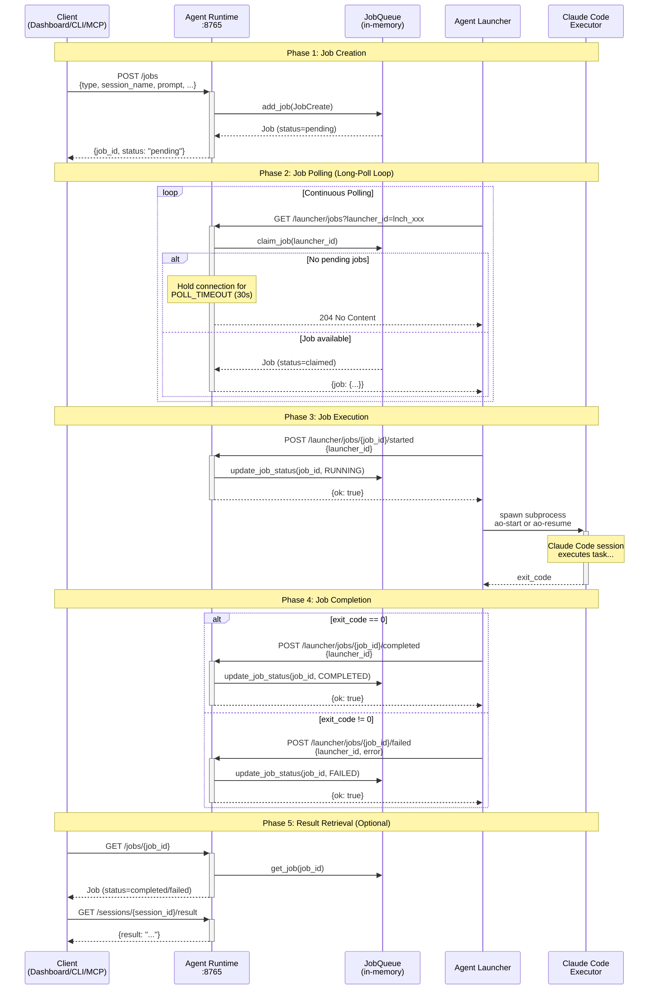

# Job Execution Flow

This document explains the complete lifecycle of a job from creation to completion, with a focus on the Agent Launcher's polling mechanism.

## Overview

When a client (Dashboard, CLI, or MCP Server) wants to start or resume an agent session, it doesn't spawn the process directly. Instead, it creates a **job** in the Agent Runtime's queue. The **Agent Launcher**, running on a host machine, continuously polls for pending jobs, claims them, and executes them.

This decoupled architecture allows:
- Agent Runtime to run in containers (no subprocess spawning needed)
- Multiple launchers to distribute workload across machines
- Graceful handling of launcher failures

## Sequence Diagram



## Phase Details

### Phase 1: Job Creation

**Trigger:** Client calls `POST /jobs`

```json
{
  "type": "start_session",
  "session_name": "research-task",
  "agent_name": "researcher",
  "prompt": "Research quantum computing advances",
  "project_dir": "/path/to/project"
}
```

**What happens:**
1. Agent Runtime receives the request
2. `JobQueue.add_job()` creates a new `Job` with:
   - Unique `job_id` (e.g., `job_abc123def456`)
   - Status set to `pending`
   - `created_at` timestamp
3. Job is stored in the in-memory dictionary
4. Client receives `{job_id, status: "pending"}` immediately

**Key point:** The client does NOT wait for execution - it gets an immediate response with the job ID for tracking.

### Phase 2: Job Polling

**Trigger:** Agent Launcher's `JobPoller` thread runs continuously

The launcher uses **long-polling** to efficiently wait for jobs without hammering the server:

```
┌─────────────────────────────────────────────────────────────────┐
│                     Long-Poll Cycle                             │
├─────────────────────────────────────────────────────────────────┤
│  1. Launcher sends GET /launcher/jobs?launcher_id=lnch_xxx      │
│  2. Runtime checks for pending jobs                             │
│  3. If no jobs: hold connection open for 30 seconds             │
│  4. If job arrives during wait: return immediately              │
│  5. After timeout: return 204 No Content                        │
│  6. Launcher immediately starts new poll cycle                  │
└─────────────────────────────────────────────────────────────────┘
```

**Job claiming is atomic:**
```python
# In job_queue.py
def claim_job(self, launcher_id: str) -> Optional[Job]:
    with self._lock:  # Thread-safe
        for job in self._jobs.values():
            if job.status == JobStatus.PENDING:
                job.status = JobStatus.CLAIMED
                job.launcher_id = launcher_id
                job.claimed_at = now
                return job
    return None
```

**Why long-polling?**
- More efficient than frequent short polls (reduces network overhead)
- Lower latency than fixed-interval polling (job starts within milliseconds)
- Simple to implement (no WebSocket complexity on launcher side)

### Phase 3: Job Execution

**Trigger:** Launcher receives a job from polling

**Sequence:**
1. Launcher calls `POST /launcher/jobs/{job_id}/started`
2. Job status changes: `claimed` → `running`
3. `JobExecutor` spawns the appropriate subprocess:

```python
# executor.py
def _execute_start_session(self, job: Job) -> subprocess.Popen:
    cmd = [
        self.ao_start_path,
        "--session-name", job.session_name,
        "--prompt", job.prompt,
    ]
    if job.agent_name:
        cmd.extend(["--agent", job.agent_name])

    env = os.environ.copy()
    env["AGENT_SESSION_NAME"] = job.session_name

    return subprocess.Popen(cmd, env=env, ...)
```

**Process supervision:**
- `JobSupervisor` thread monitors all running subprocesses
- Checks process status every second
- Captures exit codes when processes terminate

### Phase 4: Job Completion

**Trigger:** Subprocess exits

**Two possible outcomes:**

| Exit Code | Status | API Call |
|-----------|--------|----------|
| 0 | `completed` | `POST /launcher/jobs/{job_id}/completed` |
| Non-zero | `failed` | `POST /launcher/jobs/{job_id}/failed` |

```python
# supervisor.py
def _handle_completion(self, job_id: str, running_job: RunningJob, return_code: int):
    if return_code == 0:
        self.api_client.report_completed(self.launcher_id, job_id)
    else:
        error_msg = f"Process exited with code {return_code}"
        self.api_client.report_failed(self.launcher_id, job_id, error_msg)
```

### Phase 5: Result Retrieval

**Trigger:** Client wants to check job outcome

Clients can:
1. Poll `GET /jobs/{job_id}` to check status
2. Once `completed`, call `GET /sessions/{session_id}/result` to get the final output

**Alternative:** Use WebSocket connection to receive real-time session updates without polling.

## Launcher Internal Architecture

```
┌─────────────────────────────────────────────────────────────────┐
│                      Agent Launcher                              │
├─────────────────────────────────────────────────────────────────┤
│                                                                  │
│  ┌──────────────┐    ┌──────────────┐    ┌──────────────┐       │
│  │  JobPoller   │    │ JobExecutor  │    │JobSupervisor │       │
│  │   (thread)   │    │   (class)    │    │   (thread)   │       │
│  └──────┬───────┘    └──────┬───────┘    └──────┬───────┘       │
│         │                   │                   │                │
│         │ poll_job()        │ execute()         │ check_jobs()  │
│         ▼                   ▼                   ▼                │
│  ┌─────────────────────────────────────────────────────────┐    │
│  │              RuntimeAPIClient                            │    │
│  │  - register(), poll_job(), report_started()             │    │
│  │  - report_completed(), report_failed(), heartbeat()     │    │
│  └─────────────────────────────────────────────────────────┘    │
│                              │                                   │
└──────────────────────────────│───────────────────────────────────┘
                               │ HTTP
                               ▼
                    ┌─────────────────────┐
                    │   Agent Runtime     │
                    │      :8765          │
                    └─────────────────────┘
```

### Component Responsibilities

| Component | Thread | Responsibility |
|-----------|--------|----------------|
| `JobPoller` | Background | Continuously polls for pending jobs, spawns executors |
| `JobExecutor` | Main | Maps job types to CLI commands, spawns subprocesses |
| `JobSupervisor` | Background | Monitors running processes, reports completion/failure |
| `RuntimeAPIClient` | Shared | HTTP client for all Agent Runtime communication |
| `HeartbeatSender` | Background | Sends periodic heartbeats to maintain registration |

## Timing Configuration

| Parameter | Default | Environment Variable | Description |
|-----------|---------|---------------------|-------------|
| Poll Timeout | 30s | `LAUNCHER_POLL_TIMEOUT` | How long to hold connection waiting for jobs |
| Heartbeat Interval | 60s | `LAUNCHER_HEARTBEAT_INTERVAL` | How often launcher sends heartbeat |
| Heartbeat Timeout | 120s | `LAUNCHER_HEARTBEAT_TIMEOUT` | When launcher is considered stale |
| Supervisor Check | 1s | (hardcoded) | How often to check subprocess status |

## Error Handling

### Launcher Connection Failures

```
┌─────────────────────────────────────────────────────────────┐
│  Connection Failure Handling                                 │
├─────────────────────────────────────────────────────────────┤
│  Attempt 1: Connection refused                               │
│      → Wait 5 seconds, retry                                │
│  Attempt 2: Connection refused                               │
│      → Wait 5 seconds, retry                                │
│  Attempt 3: Connection refused                               │
│      → MAX_RETRIES exceeded, launcher exits                 │
└─────────────────────────────────────────────────────────────┘
```

### Job Execution Failures

| Failure Type | Handling |
|--------------|----------|
| Subprocess crashes | Supervisor detects non-zero exit, reports `failed` |
| Subprocess hangs | No built-in timeout (relies on Claude Code's own limits) |
| Launcher dies mid-job | Job stays in `running` state; requires manual cleanup |

## Related Documentation

- [JOBS_API.md](./JOBS_API.md) - Complete API reference
- [API.md](./API.md) - All Agent Runtime endpoints
- [../ARCHITECTURE.md](../ARCHITECTURE.md) - System architecture overview