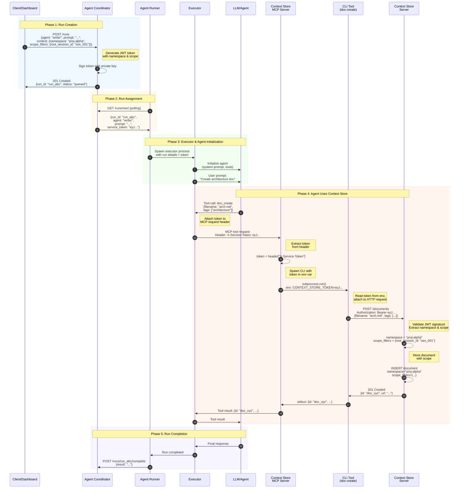

# Context Store Integration Flow

**Status:** Draft
**Date:** 2026-01-12

## Overview

This document visualizes the complete flow of an agent run that stores a document in the Context Store, showing all components involved and how the service token flows through the system.

## Architecture Diagram



## Flow Steps Explained

### Phase 1: Run Creation

| Step | Component | Action | Data |
|------|-----------|--------|------|
| 1 | Client | Creates run request | `{agent, prompt, context: {namespace, scope_filters}}` |
| 2 | Coordinator | Generates JWT token | Embeds namespace + scope_filters in payload, signs with private key |
| 3 | Coordinator | Returns run ID | Run queued for processing |

**Token payload generated:**
```json
{
  "iss": "agent-coordinator",
  "sub": "run_abc",
  "exp": 1736603600,
  "services": {
    "context-store": {
      "namespace": "proj-alpha",
      "scope_filters": {"root_session_id": "ses_001"}
    }
  }
}
```

### Phase 2: Run Assignment

| Step | Component | Action | Data |
|------|-----------|--------|------|
| 4 | Runner | Polls for available runs | `GET /runs/next` |
| 5 | Coordinator | Assigns run to runner | Includes `service_token` in payload |

**Run assignment payload:**
```json
{
  "run_id": "run_abc",
  "agent": "writer",
  "prompt": "Create architecture doc",
  "service_token": "eyJhbGciOiJSUzI1NiIs..."
}
```

### Phase 3: Executor & Agent Initialization

| Step | Component | Action | Data |
|------|-----------|--------|------|
| 6 | Runner | Spawns executor process | Passes run details + token |
| 7 | Executor | Initializes LLM/agent | System prompt, available tools |
| 8 | Executor | Sends user prompt | The task to perform |

### Phase 4: Agent Uses Context Store

| Step | Component | Action | Data |
|------|-----------|--------|------|
| 9 | LLM | Decides to create document | Tool call: `doc_create` |
| 10 | Executor | Forwards to MCP Server | Attaches token in `X-Service-Token` header |
| 11 | MCP Server | Extracts token from header | Prepares for CLI invocation |
| 12 | MCP Server | Spawns CLI subprocess | Sets `CONTEXT_STORE_TOKEN` env var |
| 13 | CLI | Calls Context Store API | `Authorization: Bearer <token>` |
| 14 | Context Store | Validates token | Verifies signature with Coordinator's public key |
| 15 | Context Store | Extracts scope | `namespace`, `scope_filters` from token |
| 16 | Context Store | Stores document | Document saved with namespace + scope_filters |
| 17-20 | All | Response flows back | Document ID returned to LLM |

**Key security points:**
- LLM only sees tool parameters (`filename`, `tags`) - never the token or scope
- Token flows: Coordinator → Runner → Executor → MCP Server → CLI → Context Store
- Each component passes token to the next via appropriate mechanism

### Phase 5: Run Completion

| Step | Component | Action | Data |
|------|-----------|--------|------|
| 21 | LLM | Produces final response | Task completed |
| 22 | Executor | Reports completion | Sends result to Runner |
| 23 | Runner | Updates Coordinator | Run marked complete |

## Component Responsibilities Summary

| Component | Receives Token Via | Passes Token Via | Role |
|-----------|-------------------|------------------|------|
| **Coordinator** | N/A (generates it) | Run assignment payload | Trust anchor, token issuer |
| **Runner** | Run assignment payload | Process spawn | Run orchestration |
| **Executor** | Process startup | HTTP header to MCP | Agent execution |
| **MCP Server** | HTTP header (`X-Service-Token`) | Env var to CLI | Tool adapter |
| **CLI** | Env var (`CONTEXT_STORE_TOKEN`) | HTTP header (`Authorization`) | API client |
| **Context Store** | HTTP header (`Authorization`) | N/A (validates & uses) | Data storage with scoping |

## Document Stored

After this flow, the Context Store contains:

```json
{
  "id": "doc_xyz",
  "filename": "arch.md",
  "namespace": "proj-alpha",
  "scope_filters": {"root_session_id": "ses_001"},
  "tags": ["architecture"],
  "content": "..."
}
```

This document is visible to:
- Any request with `namespace=proj-alpha` and `scope_filters.root_session_id=ses_001`
- Any request with `namespace=proj-alpha` and no scope_filters (sees all)

This document is NOT visible to:
- Requests with different namespace
- Requests with different `root_session_id`

## References

- [External Service Token Architecture](./external-service-token-architecture-with-scoping.md) - Foundational pattern
- [Context Store Token-Based Scoping](./context-store-token-based-scoping.md) - Context Store specific design
- [Context Store Scoping](../context-store-scoping/context-store-scoping.md) - Namespace and scope filter design
