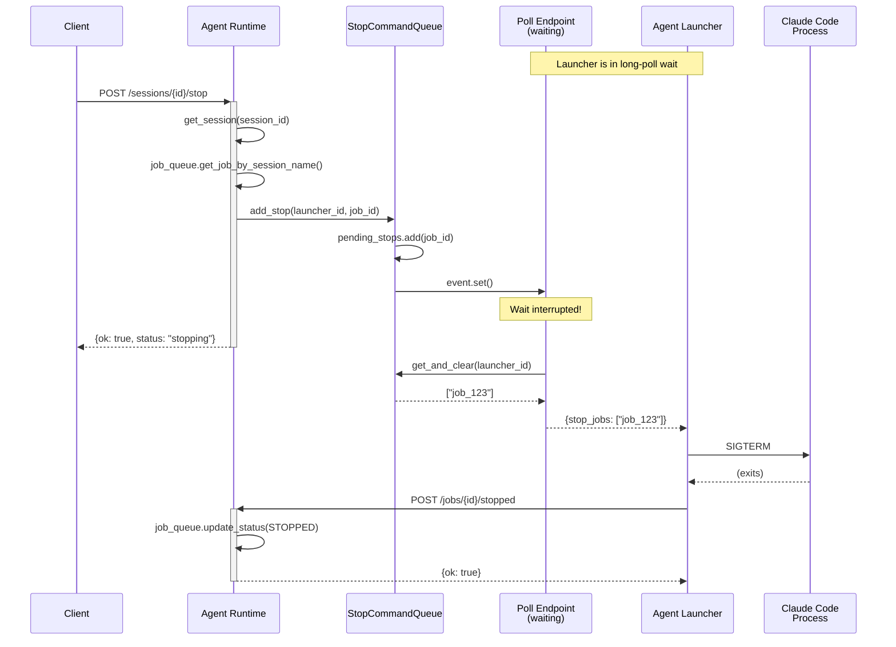

# Feature: Session Stop Command

Stop running agent sessions from the Agent Runtime, with immediate propagation to the Agent Launcher via the long-poll mechanism.

## Motivation

Currently, once a job is started, there's no way to stop it from the Agent Runtime. Users may need to:
- Cancel long-running tasks that are no longer needed
- Stop sessions that are stuck or behaving unexpectedly
- Free up launcher capacity for higher-priority work

## Overview

```
Dashboard/API                Agent Runtime              Agent Launcher
      │                            │                          │
      │ POST /sessions/{id}/stop   │                          │
      │───────────────────────────►│                          │
      │                            │                          │
      │                            │ queue stop command       │
      │                            │ wake up poll event       │
      │                            │                          │
      │                            │◄─────────────────────────│
      │                            │  (poll wakes immediately)│
      │                            │                          │
      │                            │─────────────────────────►│
      │                            │  {stop_jobs: ["job_123"]}│
      │                            │                          │
      │                            │                     terminate process
      │                            │                          │
      │                            │◄─────────────────────────│
      │                            │  POST /jobs/{id}/stopped │
      │                            │                          │
      │◄───────────────────────────│                          │
      │  {ok: true, status: "stopping"}                       │
```

## Design

### New Components

#### 1. StopCommandQueue Service

A new service to manage pending stop commands with asyncio Events for immediate wake-up.

**File:** `servers/agent-runtime/services/stop_command_queue.py`

```python
import asyncio
import threading
from typing import Optional
from dataclasses import dataclass, field

@dataclass
class LauncherStopState:
    """Stop commands and event for a single launcher."""
    pending_stops: set[str] = field(default_factory=set)  # job_ids
    event: asyncio.Event = field(default_factory=asyncio.Event)

class StopCommandQueue:
    """Thread-safe queue for stop commands with async event signaling."""

    def __init__(self):
        self._launchers: dict[str, LauncherStopState] = {}
        self._lock = threading.Lock()

    def register_launcher(self, launcher_id: str, loop: asyncio.AbstractEventLoop):
        """Register a launcher and create its event on the given event loop."""
        with self._lock:
            if launcher_id not in self._launchers:
                # Create event on the correct event loop
                self._launchers[launcher_id] = LauncherStopState(
                    event=asyncio.Event()
                )

    def unregister_launcher(self, launcher_id: str):
        """Remove launcher state when deregistered."""
        with self._lock:
            self._launchers.pop(launcher_id, None)

    def add_stop(self, launcher_id: str, job_id: str) -> bool:
        """Queue a stop command and wake up the launcher's poll.

        Returns True if command was queued, False if launcher not found.
        """
        with self._lock:
            state = self._launchers.get(launcher_id)
            if not state:
                return False

            state.pending_stops.add(job_id)
            state.event.set()  # Wake up the poll!
            return True

    def get_and_clear(self, launcher_id: str) -> list[str]:
        """Get pending stop commands and clear them.

        Returns list of job_ids to stop.
        """
        with self._lock:
            state = self._launchers.get(launcher_id)
            if not state:
                return []

            stops = list(state.pending_stops)
            state.pending_stops.clear()
            state.event.clear()
            return stops

    def get_event(self, launcher_id: str) -> Optional[asyncio.Event]:
        """Get the asyncio Event for a launcher (for poll wait)."""
        with self._lock:
            state = self._launchers.get(launcher_id)
            return state.event if state else None

# Module-level singleton
stop_command_queue = StopCommandQueue()
```

#### 2. New Job Status: STOPPED

**File:** `servers/agent-runtime/services/job_queue.py`

```python
class JobStatus(str, Enum):
    PENDING = "pending"
    CLAIMED = "claimed"
    RUNNING = "running"
    COMPLETED = "completed"
    FAILED = "failed"
    STOPPED = "stopped"  # NEW
```

### API Changes

#### New Endpoint: Stop Session

```
POST /sessions/{session_id}/stop
```

**Response (Success):**
```json
{
  "ok": true,
  "session_id": "abc-123",
  "job_id": "job_xyz789",
  "status": "stopping"
}
```

**Response (Session Not Running):**
```json
{
  "detail": "Session is not running"
}
```
Status: `400 Bad Request`

**Response (No Job Found):**
```json
{
  "detail": "No active job found for session"
}
```
Status: `404 Not Found`

#### Modified Endpoint: Poll for Jobs

```
GET /launcher/jobs?launcher_id={id}
```

**New Response Type (Stop Commands):**
```json
{
  "stop_jobs": ["job_123", "job_456"]
}
```

The response can now be one of:
- `{"job": {...}}` - New job to execute
- `{"stop_jobs": [...]}` - Jobs to stop
- `{"deregistered": true}` - Shutdown signal
- `204 No Content` - Nothing to do

#### New Endpoint: Report Job Stopped

```
POST /launcher/jobs/{job_id}/stopped
```

**Request Body:**
```json
{
  "launcher_id": "lnch_abc123",
  "signal": "SIGTERM"
}
```

**Response:**
```json
{
  "ok": true
}
```

### Implementation Details

#### Agent Runtime: Modified Poll Endpoint

**File:** `servers/agent-runtime/main.py`

```python
@app.get("/launcher/jobs")
async def poll_for_jobs(launcher_id: str = Query(...)):
    """Long-poll for available jobs or stop commands."""

    # Check deregistration (existing)
    if launcher_registry.is_deregistered(launcher_id):
        launcher_registry.confirm_deregistered(launcher_id)
        return {"deregistered": True}

    # Verify launcher (existing)
    if not launcher_registry.get_launcher(launcher_id):
        raise HTTPException(status_code=401, detail="Launcher not registered")

    # Get the event for this launcher
    event = stop_command_queue.get_event(launcher_id)
    poll_interval = 0.5
    elapsed = 0.0

    while elapsed < LAUNCHER_POLL_TIMEOUT:
        # Check for stop commands FIRST (new)
        stop_jobs = stop_command_queue.get_and_clear(launcher_id)
        if stop_jobs:
            return {"stop_jobs": stop_jobs}

        # Check for deregistration (existing)
        if launcher_registry.is_deregistered(launcher_id):
            launcher_registry.confirm_deregistered(launcher_id)
            return {"deregistered": True}

        # Check for new jobs (existing)
        job = job_queue.claim_job(launcher_id)
        if job:
            return {"job": job.model_dump()}

        # Wait with event (modified)
        if event:
            try:
                await asyncio.wait_for(event.wait(), timeout=poll_interval)
                # Event was set - loop will check stop_jobs
            except asyncio.TimeoutError:
                pass
        else:
            await asyncio.sleep(poll_interval)

        elapsed += poll_interval

    return Response(status_code=204)
```

#### Agent Runtime: Stop Session Endpoint

**File:** `servers/agent-runtime/main.py`

```python
@app.post("/sessions/{session_id}/stop")
async def stop_session(session_id: str):
    """Stop a running session by signaling its launcher."""

    # Get session
    session = get_session_by_id(session_id)
    if not session:
        raise HTTPException(status_code=404, detail="Session not found")

    if session.status != "running":
        raise HTTPException(status_code=400, detail="Session is not running")

    # Find the job for this session
    job = job_queue.get_job_by_session_name(session.session_name)
    if not job:
        raise HTTPException(status_code=404, detail="No active job found for session")

    if not job.launcher_id:
        raise HTTPException(status_code=400, detail="Job not claimed by any launcher")

    # Queue the stop command
    if not stop_command_queue.add_stop(job.launcher_id, job.job_id):
        raise HTTPException(status_code=500, detail="Failed to queue stop command")

    # Update job status
    job_queue.update_job_status(job.job_id, JobStatus.STOPPING)

    return {
        "ok": True,
        "session_id": session_id,
        "job_id": job.job_id,
        "status": "stopping"
    }
```

#### Agent Launcher: Handle Stop Commands

**File:** `servers/agent-launcher/lib/poller.py`

```python
def _poll_cycle(self):
    result = self.api_client.poll_job(self.launcher_id)

    if result.deregistered:
        self._running = False
        return

    # Handle stop commands (new)
    if result.stop_jobs:
        for job_id in result.stop_jobs:
            self._handle_stop(job_id)
        return

    if result.job:
        self._handle_job(result.job)

def _handle_stop(self, job_id: str):
    """Stop a running job by terminating its process."""
    running_job = self.supervisor.get_running_job(job_id)
    if running_job:
        # Send SIGTERM first (graceful)
        running_job.process.terminate()

        # Wait briefly for graceful shutdown
        try:
            running_job.process.wait(timeout=5)
        except subprocess.TimeoutExpired:
            # Force kill if not responding
            running_job.process.kill()

        # Report stopped
        self.api_client.report_stopped(self.launcher_id, job_id, signal="SIGTERM")
```

#### Agent Launcher: API Client Extension

**File:** `servers/agent-launcher/lib/api_client.py`

```python
@dataclass
class PollResult:
    job: Optional[Job] = None
    deregistered: bool = False
    stop_jobs: list[str] = field(default_factory=list)  # NEW

def poll_job(self, launcher_id: str) -> PollResult:
    response = self.session.get(
        f"{self.base_url}/launcher/jobs",
        params={"launcher_id": launcher_id},
        timeout=self.poll_timeout + 5
    )

    if response.status_code == 204:
        return PollResult()

    data = response.json()

    if data.get("deregistered"):
        return PollResult(deregistered=True)

    # NEW: Handle stop commands
    if "stop_jobs" in data:
        return PollResult(stop_jobs=data["stop_jobs"])

    if "job" in data:
        return PollResult(job=Job(**data["job"]))

    return PollResult()

def report_stopped(self, launcher_id: str, job_id: str, signal: str = "SIGTERM"):
    """Report that a job was stopped."""
    response = self.session.post(
        f"{self.base_url}/launcher/jobs/{job_id}/stopped",
        json={"launcher_id": launcher_id, "signal": signal}
    )
    response.raise_for_status()
```

## Sequence Diagram



## Error Handling

| Scenario | Response | Status |
|----------|----------|--------|
| Session not found | `{"detail": "Session not found"}` | 404 |
| Session not running | `{"detail": "Session is not running"}` | 400 |
| No job for session | `{"detail": "No active job found for session"}` | 404 |
| Job not claimed | `{"detail": "Job not claimed by any launcher"}` | 400 |
| Launcher offline | Stop command queued, delivered when launcher reconnects | 200 |

## Edge Cases

### 1. Launcher Disconnected
- Stop command is queued in `StopCommandQueue`
- When launcher reconnects and polls, it receives the stop command
- If job already completed, launcher ignores the stop (job not in running_jobs)

### 2. Process Ignores SIGTERM
- Launcher waits 5 seconds after SIGTERM
- If process still running, sends SIGKILL
- Reports stopped with `signal: "SIGKILL"`

### 3. Multiple Stop Requests
- Additional stops for same job_id are deduplicated (using set)
- Only one stop command sent to launcher

### 4. Race: Job Completes While Stop In-Flight
- Launcher receives stop command
- Looks up job in `running_jobs` - not found (already completed)
- Ignores stop command silently
- Job status remains COMPLETED (not overwritten)

## Data Model Changes

### Job Status Enum

```python
class JobStatus(str, Enum):
    PENDING = "pending"
    CLAIMED = "claimed"
    RUNNING = "running"
    STOPPING = "stopping"  # NEW: Stop requested, waiting for launcher
    COMPLETED = "completed"
    FAILED = "failed"
    STOPPED = "stopped"    # NEW: Successfully stopped
```

### Job Status Transitions

```
                              ┌──────────┐
                              │ STOPPING │◄─── POST /sessions/{id}/stop
                              └────┬─────┘
                                   │
┌─────────┐   ┌─────────┐   ┌─────────┐   ┌───────────┐
│ PENDING │──►│ CLAIMED │──►│ RUNNING │──►│ COMPLETED │
└─────────┘   └─────────┘   └────┬────┘   └───────────┘
                                 │
                                 │         ┌─────────┐
                                 └────────►│ FAILED  │
                                           └─────────┘
                                 │
                                 │         ┌─────────┐
                                 └────────►│ STOPPED │◄─── POST /jobs/{id}/stopped
                                           └─────────┘
```

## Files to Modify

| File | Changes |
|------|---------|
| `servers/agent-runtime/services/stop_command_queue.py` | NEW: StopCommandQueue service |
| `servers/agent-runtime/services/job_queue.py` | Add STOPPING, STOPPED status |
| `servers/agent-runtime/main.py` | Add stop endpoint, modify poll endpoint |
| `servers/agent-launcher/lib/api_client.py` | Add stop_jobs to PollResult, report_stopped() |
| `servers/agent-launcher/lib/poller.py` | Handle stop commands |
| `servers/agent-launcher/lib/supervisor.py` | Add get_running_job() method |
| `docs/agent-runtime/API.md` | Document new endpoints |
| `docs/agent-runtime/DATA_MODELS.md` | Document new job statuses |

## Future Enhancements

1. **Graceful stop with message**: Send a final prompt to Claude Code before terminating
2. **Stop timeout configuration**: Allow customizing SIGTERM→SIGKILL timeout
3. **Bulk stop**: Stop all sessions for a project or agent type
4. **Stop reason tracking**: Record why session was stopped (user request, timeout, etc.)
